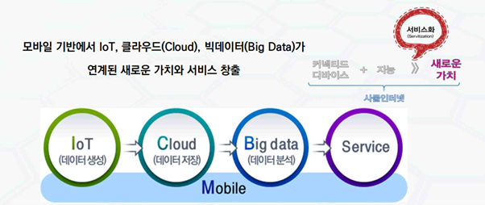
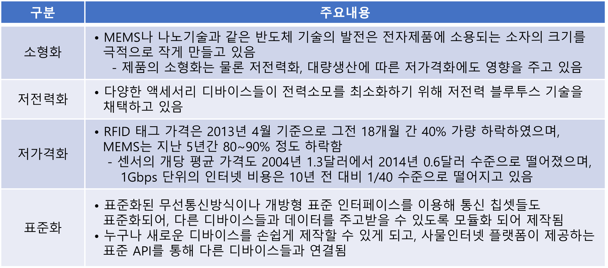

### IoT 개요

    

* 사물인터넷(Internet of Thins, IoT)은 사람, 사물, 공간, 데이터 등 모른 것이 인터넷으로 상호 연결되어, 정보가 생성/수집/공유/활용되는 초연결 인터넷을 의미함   

* 개념 (ITU-T Y.2060)   
  사물인터넷은 이미 존재하거나 향후 등장할 상호 운용 가능한 정보통신 기술을 활용하여 다양한 실재 및 가상 사물 간의 상호 연결을 통해서, 진보된 서비스를 제공할 수 있게 하는 글로벌 인프라스트럭쳐임   
  (센서, 상황인지기술, 통신, 네트워크 기술, 칩 디바이스 기술, 경량 임베디드 네트워크 기술, 자율적/지능형 플랫폼 기술, 대량의 데이터를 처리하는 빅데이터 기술, 데이터 마이닝 기술, 사용자 중심의 응용 서비스 기술, 웹 서비스 기술, 보안, 프라이버시 보호 기술 등)   
 
    </img>    
    
       
    
### IoT 특징    
    

    
  
    
   

### IoT 표준   
 

* oneM2M

  - 전세계 지역별 표준 개발기구인 TTA(한국), ETSI(유럽), ATIS/TIA(북미), CCSA(중국), ARIB.TCC(일본) 등 7개 표준개발단체가 진행   
  - 구조가 튼튼하고 견고한 표준안을 제안하고 진행되고 있으나, 복잡도가 높아 저성능 CPU에서는 어려움이 많음   
  - https://onem2m.org    

  

* OCF (Open Connectivity Foundation)

  - 삼성, 인텔 등을 중심으로 추진되고 있는 기업 표준   
  - 경량형 구조를 지향하고 있으나, 연동 기기나 시스템, 솔루션과의 연동에 대한 다양성이 부족함   
  - https://openconnectivity.org   
  

### AIoT 구성 요소   
 

* 스마트 디바이스     

  - 각종 센서와 네트워크 기능이 탑재된 디바이스를 말하는 것으로,
  - 각종 센서/통신모듈, 배터리/전원장치 등의 전력모듈, CPU 등의 하드웨어와 
  - OS, Embedded SW 플랫폼 및 어플리케이션으로 구성되어 있다.    

* 
